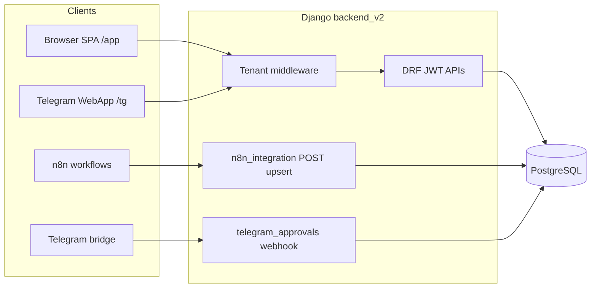
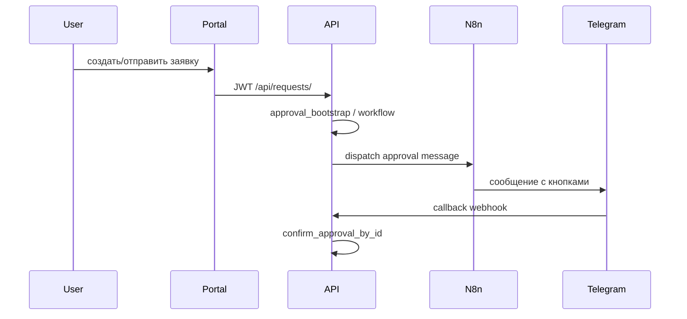

# Kolberg v2: структура приложения и взаимодействия

Справочник по стеку, мультитенантности, Django-приложениям/модулям `backend_v2`, их API и связям с `frontend_v2` (маршруты, интеграции n8n/Telegram).

## Назначение продукта

**Kolberg v2** — мультитенантный корпоративный портал: заявки на оплату с многошаговым согласованием, финансовые модули (касса, банк, корпоративная карта, начисления ЗП), справочники (поставщики, кошельки/кассы), заметки, обратная связь. Данные из внешних систем (в т.ч. **n8n**) импортируются через отдельный интеграционный API. Согласование через **Telegram** идёт через webhook-мост.

---

## Технологический стек

| Слой | Технологии |
|------|------------|
| Backend | Django, **Django REST Framework**, **simplejwt** (JWT), PostgreSQL |
| Frontend | React 18, **Vite**, **Ant Design** 5, **@ant-design/pro-layout**, react-router-dom 6 |
| Статика SPA | `frontend_v2` собирается с `base: '/app/'` ([vite.config.ts](../frontend_v2/vite.config.ts)) |

Аутентификация портала: **Bearer JWT** в `Authorization`; клиент хранит пару access/refresh в `localStorage` (портал) или `sessionStorage` (ветка `/tg/*`) и при 401 один раз обновляет access через `/api/auth/token/refresh/` ([api.ts](../frontend_v2/src/lib/api.ts)).

---

## Мультитенантность

- **Идентификация тенанта**: поддомен в `Host`, сопоставление с `BASE_DOMAIN` из окружения ([middleware.py](../backend_v2/apps/tenants/middleware.py)).
- **`request.tenant`**: прикрепляется middleware; без валидного поддомена/тенанта обычные запросы получают **404** «Unknown tenant».
- **Особый случай n8n**: для путей под `/api/<n8n_prefix>/` сначала срабатывает [N8nIntegrationTenantMiddleware](../backend_v2/apps/modules/n8n_integration/middleware.py) (те же правила Host/subdomain, но ответы **400/404 JSON**, а не общий 404 портала).

Модели тенанта и доступа: [models.py](../backend_v2/apps/tenants/models.py) — `Tenant`, `TenantMembership`, `TenantModuleConfig` (вкл/выкл модуль у тенанта), `TenantUserRole` (роли и `step` для согласований), `TenantIntegrationConfig` (секреты и URL интеграций, шаблоны Telegram).

---

## Включение модулей и роли

- **Каталог модулей** для UI и админки: [apps/modules/registry.py](../backend_v2/apps/modules/registry.py) — статический список `{ module_key, display_name }`.
- **Эффективный доступ** к API модуля: `TenantModuleConfig.is_enabled` **и** роль пользователя в `ROLE_MODULE_ACCESS` ([permissions.py](../backend_v2/apps/tenants/permissions.py)), плюс активное `TenantMembership`.
- Эндпоинт **`GET /api/modules/`** ([views.py](../backend_v2/apps/tenants/views.py)) отдаёт для каждого модуля флаги `tenant_enabled`, `user_allowed`, `effective_enabled` — так строится [DashboardPage](../frontend_v2/src/ui/DashboardPage.tsx).
- Настройка включения модулей (только tenant admin): **`PUT /api/tenant-module-config/`** с `IsTenantAdmin`.
- Роль **`director`** объявлена в `TenantUserRole`, но **не привязана** ни к одному ключу в `ROLE_MODULE_ACCESS` — на уровне модульных прав фактически не даёт доступа, пока не расширят матрицу.

Ключи `module_key` (связь бекенд ↔ матрица прав ↔ фронт при необходимости):

- `requests`, `vendors`, `cash`, `bank`, `corporate_card`, `notes`, `n8n_integration`, `telegram_approvals`, `payroll`, `wallets`

**Обратная связь** (`apps.modules.feedback`) в `INSTALLED_APPS` и URL есть, но **не входит** в `list_modules()` — на панели модулей не отображается как отдельный модуль.

---

## Карта HTTP API (корень [config/urls.py](../backend_v2/config/urls.py))

| Префикс | Назначение |
|---------|------------|
| `/api/admin/` | Django admin |
| `/api/auth/token/`, `.../refresh/` | JWT |
| `/api/auth/otp/request`, `/api/auth/otp/verify` | OTP (Telegram и др.) |
| `/api/auth/telegram/webapp/` | вход из Telegram WebApp |
| `/api/auth/password/change/` | смена пароля |
| `/api/files/gateway/`, `.../download/` | шлюз/скачивание файлов к заявкам |
| `/api/modules/`, `/api/tenant-module-config/`, `/api/tenant-integration-config/` | каталог модулей, конфиг тенанта |
| `/api/requests/` | заявки, формы, согласования, авто-заявки |
| `/api/vendors/` | справочник поставщиков |
| `/api/cash/`, `/api/bank/`, `/api/corporate-card/` | движения по каналам |
| `/api/notes/` | заметки к сущностям |
| `/api/feedback/` | AI-уточнение текста + отправка фидбека |
| `/api/payroll/` | документы/строки ЗП |
| `/api/wallets/` | кассы (cash registers) и кошельки |
| `/api/telegram-approvals/webhook/` | callback от Telegram (без JWT, проверка интеграционного токена) |
| `/api/<n8n_prefix>/` | upsert из n8n (дублирование префикса при кастомном пути — см. settings) |

Переменные окружения (фрагмент): [settings.py](../backend_v2/config/settings.py) — `BASE_DOMAIN`, `N8N_INTEGRATION_*`, webhooks для feedback и Telegram bridge. Токен file gateway — только в `TenantIntegrationConfig.requests_file_gateway_token`.

Подробный контракт n8n: [n8n_integration.md](../backend_v2/n8n_integration.md).

---

## Backend: приложения и доменные модели

### `apps.accounts`

- Кастомный пользователь **`User`** (`AUTH_USER_MODEL`): `full_name`, `telegram_chat_id`, `telegram_from_id` ([models.py](../backend_v2/apps/accounts/models.py)).
- **`OtpChallenge`** — одноразовые коды для входа.

### `apps.tenants`

- Уже описаны tenant, членство, роли, интеграции.
- **`Tenant.telegram_bot_token_enc`** — шифрование на стороне модели (OTP/Telegram).

### `apps.modules.requests` (ядро портала)

- **`Request`**: заявка (сумма, валюта, тип оплаты, срочность, статусы от DRAFT до PAYED/REJECTED, связь с `Vendor`, поля для привязки к расходу `expense_id`, дата биллинга) ([models.py](../backend_v2/apps/modules/requests/models.py)).
- **`Approval`**: шаг согласования (serial/payment), решение pending/approved/rejected, связь с Telegram (`message_id`, `approver_tg_id`, `approver_tg_from_id`).
- Конфигурация формы: `RequestFormConfig` и связанные сущности (типы оплаты, заявители, поставщики, назначения платежа, **категории** `RequestCategory`).
- Конфигурация согласования: `RequestApprovalConfig`, шаги и назначенные согласующие; интеграционные поля для Telegram/n8n (см. миграции и `integration_settings` модуля).
- **Автозаявки**: `AutoRequestTemplate` + логика в `auto_requests.py`, bootstrap согласований в `approval_bootstrap.py`, переходы статусов в `approval_workflow.py`.
- **ViewSet** и отдельные views: [urls.py](../backend_v2/apps/modules/requests/urls.py) — CRUD заявок, конфиги, `approvals/resend`, файлы, опции формы.
- Связь с Telegram: вызовы из [views.py](../backend_v2/apps/modules/requests/views.py) в `telegram_approvals.services` (отправка/редактирование сообщений, resend).

### `apps.modules.vendors`

- **`Vendor`**: kind `cash` / `transfer`, ИНН и уникальность по правилам для transfer ([models.py](../backend_v2/apps/modules/vendors/models.py)).

### `apps.modules.wallets`

- **`CashRegister`**: одна запись на пару (tenant, currency); **`BankAccount`**: синтетический якорь «один банковский кошелёк на тенанта»; **`CorporateCardAccount`**: на (tenant, currency); **`Wallet`**: тип cash/bank/corporate_card, opening balance, строгие FK-ограничения ([models.py](../backend_v2/apps/modules/wallets/models.py)).
- **Разрешения**: чтение шире, запись финансовых полей — admin/accountant (`HasWalletsFinancialWriteAccess` в связке с `HasEffectiveModuleAccess`).

### `apps.modules.cashier`

- **`CashExpense`** (external_id + год уникальны в тенанте), **`CashRevenue`** — привязка к **`Wallet`** и опционально `Vendor`.

### `apps.modules.bank_expenses`

- **`BankExpense`** / **`BankRevenue`** — строки выписки, контрагент, суммы, **`Wallet`**.

### `apps.modules.corporate_card`

- **`CardExpense`**, **`CardRevenue`** (как расход: `title`, `amount`, `revenue_at`, `note`, `payload`; плюс `external_id`, `confirmed`), **`Wallet`**.

### `apps.modules.payroll`

- **`PayrollDocument`** (уникальный `doc_id` в тенанте), **`PayrollLine`**.
- Константа категории зарплаты для связи с заявками: [constants.py](../backend_v2/apps/modules/payroll/constants.py).

### `apps.modules.notes`

- **`Note`**: получатель, `target_type` (request/cash/bank), `target_id`, статус доставки.

### `apps.modules.n8n_integration`

- **Аутентификация**: для upsert/read и справочников — только `X-N8N-Integration-Token` (tenant config или env), без JWT ([authentication.py](../backend_v2/apps/modules/n8n_integration/authentication.py)). Исключение: `POST /api/n8n/requests/ai-create/` — token + JWT (нужен пользователь заявки).
- **GET** `wallet-balances/` — остатки кошельков по каналам (как `/api/cash|bank|corporate-card/balances/`).
- **POST upsert** по целочисленному `id` для: vendors, cash/bank/corporate expenses & revenues, notes, payroll lines ([urls.py](../backend_v2/apps/modules/n8n_integration/urls.py)).

### `apps.modules.telegram_approvals`

- **Webhook** `POST .../webhook/`: публичный endpoint, проверка того же интеграционного токена, разбор `callback_query`, валидация chat/from/message vs `Approval`, затем `confirm_approval_by_id` ([views.py](../backend_v2/apps/modules/telegram_approvals/views.py)).
- Сервисный слой: диспатч в n8n (bridge URL из tenant/env), шаблоны сообщений из `TenantIntegrationConfig` / request integration settings.

### `apps.modules.feedback`

- **`PortalFeedback`**: kind error/improvement, доставка в Telegram/n8n по настройкам tenant.
- Маршруты: `ai-refine/` (прокси к n8n AI path из settings), `submissions/`.

---

## Потоки взаимодействия (схемы)

---

## Frontend: маршруты и страницы

Корневой роутер: [App.tsx](../frontend_v2/src/routes/App.tsx).

- **`/login`** — вход (JWT).
- Защищённая зона **`/`** с [AppShell](../frontend_v2/src/ui/AppShell.tsx): меню Панель, Заявки, Касса, Банк, Корп. карта, Начисления ЗП, Настройки (иконки Ant Design).
- **Заявки**: список, создание, деталь, настройки формы/согласований/автозаявок (пути `/requests`, `/settings/request-*`, `/requests/auto-config`).
- **Финансы**: `/cash`, `/bank`, `/corporate-card`, `/payroll` + детальные страницы по id.
- **`/settings`** — сетка карточек из [settingsModules.tsx](../frontend_v2/src/settings/settingsModules.tsx): форма заявок, этапы согласования, интеграции tenant, кассы.
- **`/tg/*`** — отдельная оболочка [TgWebAppLayout](../frontend_v2/src/ui/tg/TgWebAppLayout.tsx): упрощённые список/создание/деталь заявок и страница подтверждения оплаты (`TgPaymentConfirmPage`), токены в session storage.

Меню ProLayout **не фильтруется** по `effective_enabled` автоматически — фильтрация доступа в основном на API; панель модулей на главной показывает статус включения.

---

## Важные файлы для ориентации

| Область | Файлы |
|---------|--------|
| URL API | [config/urls.py](../backend_v2/config/urls.py) |
| Настройки | [config/settings.py](../backend_v2/config/settings.py) |
| Реестр модулей | [apps/modules/registry.py](../backend_v2/apps/modules/registry.py) |
| Права по модулям | [apps/tenants/permissions.py](../backend_v2/apps/tenants/permissions.py) |
| Интеграции tenant | [apps/tenants/integration_settings.py](../backend_v2/apps/tenants/integration_settings.py) |
| Заявки (логика) | [apps/modules/requests/views.py](../backend_v2/apps/modules/requests/views.py), `approval_*.py`, `auto_requests.py` |
| HTTP-клиент фронта | [frontend_v2/src/lib/api.ts](../frontend_v2/src/lib/api.ts) |

---

## Итог

**backend_v2** — единый Django-проект с изолированными приложениями под домены (заявки, деньги, справочники, интеграции). Доступ двухслойный: **тенант из Host** + **модульные флаги и роли**. **frontend_v2** — SPA на том же origin (или за прокси), говорит с бекендом через относительные `/api/...` и JWT; отдельная ветка **Telegram WebApp** для полевых сценариев заявок. Внешний контур: **n8n** пишет финансовые и вспомогательные сущности через интеграционный API; **Telegram** завершает шаги согласования через webhook.
